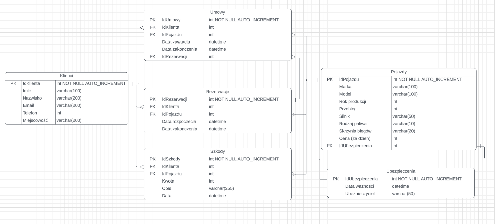

# Car Rental Management System (Database)

###  O projekcie
Kompleksowy projekt relacyjnej bazy danych do obsługi procesów w wypożyczalni samochodów. System obejmuje pełen cykl operacyjny – od zarządzania flotą i ubezpieczeniami, po ewidencję szkód, rezerwacji i umów najmu.

###  Architektura danych
Baza danych składa się z 8 zintegrowanych tabel, zapewniających spójność relacyjną (1:N oraz N:M):
* **Zarządzanie Flotą:** `pojazdy`, `ubezpieczenia`, `szkody`, `tankowania`.
* **Procesy Biznesowe:** `klienci`, `pracownicy`, `rezerwacje`, `umowy`.

### Zaawansowana Logika (Stored Logic)
Projekt wykorzystuje mechanizmy automatyzacji po stronie serwera bazy danych:
* **Procedury składowane (Stored Procedures):** m.in. `dodaj_klienta`, `aktualizuj_klienta` oraz `cena_wszystkich_pojazdow` – ułatwiające bezpieczne operacje na danych.
* **Wyzwalacze (Triggers):** np. `klient_delete` oraz `pracownik_insert_date` – dbające o automatyczne logowanie zdarzeń i integralność przy usuwaniu rekordów.
* **Widoki analityczne (Views):** Zestaw widoków (np. `widokjoin`, `widokhaving`) przygotowanych do szybkiego generowania raportów i złączeń danych.

---
### 📊 Model ERD

---
### 🛠️ Jak uruchomić?
1. Pobierz plik `car_rental_database.sql`.
2. Zaimportuj go do środowiska MariaDB/MySQL (np. przez phpMyAdmin lub MySQL Workbench).
3. Skrypt automatycznie utworzy strukturę tabel, relacje oraz zasili bazę danymi testowymi.
